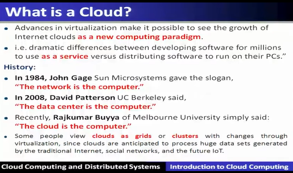

# Introduction to Cloud Computing

## Preface
* Content of this lecture
* Scalable Computing over the internet
* The Hype of Cloud - Forecasting
* Many Cloud Providers
  * AWS
  * Microsoft Azure
  * GCP
  * Rightscale, Salesforce, EMC, Gigaspaces, 10gen, Datastax, Oracle, VMWare, Yahoo, Cloudera
  * And 100s more...

## Categories of Clouds
* Private clouds
* Public clouds

## Customers Save - Time and Money

## What is a Cloud?

* A single-site cloud(as known as "Datacenter") consists of
* A geographically distributed cloud consists of 

## Computing Paradigm Distinctions